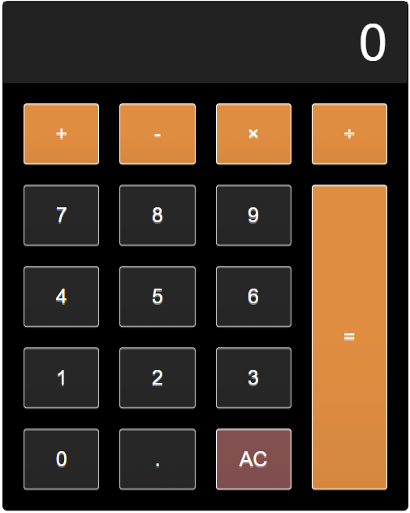

# JavaScript
Compilation of simple JS projects that I've worked on.

+ Calculator - A simple calculator implemented with vanilla JS.

+ Currency Convertor - Converts user input value into the corresponding value in another currency.

+ Digital Clock - Real-time clock that displays the time digitally.

+ Reddit Posts - Retrieves and displays the latest reddit posts from r/WorldNewsHeadlines.

+ Stopwatch - Simple JS stopwatch.

+ Survey - A simple survey made with JS. Includes some simple animations such as screen-fade when changing questions.
